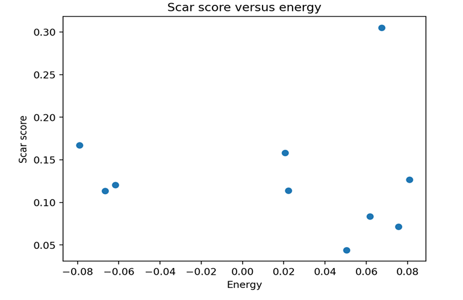

# Low-Dimensional Subspace Supporting Quantum Many-Body Scarred Eigenstates in the PXP Model

## Introduction

We investigate the structure of quantum many-body scarred eigenstates in the **PXP model** by quantifying how strongly they are supported on a low-dimensional **Krylov subspace**. Exact diagonalization is used to obtain the full spectrum and eigenstates.

## Methodology

For system size `L = 25`, we construct the Krylov subspace generated from the Néel state
|1010…⟩

via repeated application of the Hamiltonian. The resulting subspace has dimension **14**, which is much smaller than the full Hilbert space.

*Figure 1: Scar score versus energy.*

*Figure 2: Histogram of scar scores.*

*Figure 3: Sorted scar scores.*

> *(Figures can be added using standard GitHub image syntax if needed.)*

### Most Scarred Eigenstates

| Index | Energy     | Scar Score |
|------:|-----------:|-----------:|
| 7     | 0.067484   | 0.3051     |
| 0     | -0.079089  | 0.1671     |
| 3     | 0.020621   | 0.1582     |
| 9     | 0.080882   | 0.1269     |
| 2     | -0.061670  | 0.1204     |

## Conclusion

Only a small number of eigenstates exhibit large overlap with the Krylov subspace. This demonstrates that scarred eigenstates are supported by a **low-dimensional structure**, despite the exponential growth of the Hilbert space.
